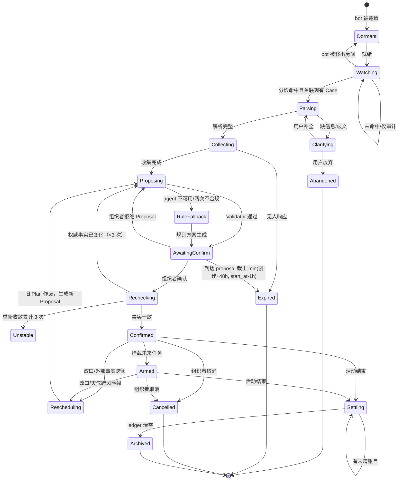

# 设计蓝图：「牵线」聚会筹办守护

> 模板来源：官方 octo-weather「行程守护」蓝图
> 蓝图版本：**v0.7.1 = 设计冻结候选**（v0.2 外部审计 / v0.3 范围分级 / v0.4 GPT 20 条 / v0.5 GPT 13 条 / v0.6 GPT 三轮 4 P0+7 P1 / v0.7 GPT 工程收口 / **v0.7.1 ZCode 本地事实审订 7 处补丁**——见文末对抗评审历史）
> 流程：v0.7 冻结候选 → G1/G2 实现（纵向切片）→ G3 OUP 真链路 GO/NO-GO → 用测试反过来发现蓝图漏洞
>
> ⚠️ **附录 A（2026-09-27 晚）：平台能力窗口开启——提交形态待定**。平台刚发布 matrix.*/octos.* host-service 能力且 Rinx 正在实时实现 broker（PR #28）。P0 纵向切片不受影响继续施工；提交形态（独立 guardian vs Hub script-app）待 G0-B + 课堂包确认，两路线共享同一套 Case/规则/验证设计。详见文末附录 A。

## 依赖与权限事实表（我们用什么、建什么）

| **依赖**                | **性质**                                                     | **依据/状态**                                                |
| ----------------------- | ------------------------------------------------------------ | ------------------------------------------------------------ |
| Matrix 房间消息读写     | **我们自己的 bot 账号**（普通 Matrix 账号 + sync API），不是宿主能力、不是 store-app 沙盒能力 | 本地 Palpo 实测通过（注册→入群→收到群消息，2026-09-27）；同构机制即 Rinx `agent_chat` 的 companion bridge-bot invites |
| Case 活动簿（状态存储） | **自建** SQLite + Web UI                                     | “日历”是官方 12 场景的选题方向名；活动簿是我们自建的状态存储，不是系统日历服务 |
| 天气与地点              | Open-Meteo 公开 API（forecast + geocoding，无 key）          | 真实公开服务，标注采集时间                                   |
| LLM 理解与措辞          | **Octos Runtime（octos serve）**——guardian 作为 OUP 客户端，按推理任务开短会话；provider（MiniMax/Kimi/本地）由 octos 配置路由 | 官方演示 AppCard→octos serve 已验证；具体参赛环境以 G0-B 官方确认结果为准 |
| 定时触发                | guardian 常驻事件循环 + **durable scheduler（SQLite 持久化）** | 不依赖宿主后台唤醒；octos goal/loop/monitor/cron 为复赛可选接入 |
| Rinx 宿主               | **零修改**：只用其现有“URL 网页卡分享”                       | 提交物 = 守护服务源码 + 活动簿页 + 启动说明                  |

> 提交形态声明：不走 store-app/Hub 卡路径。提交边界证据归档于 `docs/competition-boundary.md`；G0-B 官方确认完成前，不将该形态视为“已获官方批准”。

## 四条架构原则（全蓝图最高法则）

1. **SQLite Case 状态是唯一事实源；Octos 会话只是一次性推理上下文。**
2. **Agent 负责理解与规划（输出严格 JSON，无工具）；Guardian 负责确定性执行与验证。**
   产品叙事：
   **“Octos Runtime 驱动的结构化规划 Agent + 确定性业务执行器”**
   ——不是“自主操作 App 的 Agent”，工具不交给模型是设计约束而非缺陷。
3. **一次状态迁移 = 一个可追踪事务**：
   `case_revision + proposal_id + evidence_ref(matrix_event_id) + matrix txn_id + 审计条目`
   构成完整证据链；所有关键状态变化均可回放、可对账。
4. **两类动作，两种可靠性模型**：
   - 本地状态动作：DB 事务 → assert → commit / 可回滚；
   - 外部副作用（发消息）：**Outbox 模式** → Intent → outbox → Matrix txn → reconcile → 标记终态；
   - 外部副作用失败不假装 rollback，而进入 `UNKNOWN / NEED_RECONCILIATION`，使用同一 `txn_id` 重试/对账。

### 责任矩阵

| **职责**                                       | **归属**                                               |
| ---------------------------------------------- | ------------------------------------------------------ |
| 事件来源                                       | Matrix 房间（bot 账号 sync）                           |
| 分诊与关联判定 / 规则 / 验证 / 执行 / 主动调度 | **Guardian 自建**（durable scheduler 持久化于 SQLite） |
| LLM 推理                                       | **Octos Runtime**（octos serve，OUP 短会话）           |
| 业务状态                                       | **Guardian 自建**（SQLite，唯一事实源）                |
| 呈现                                           | Rinx 聊天 + 活动簿网页卡（自建）                       |

### 六项核心创新（锁死，不再加功能）

① 群聊 = 非结构化事件源
② Case = 长期状态事实源
③ Octos Agent 只做结构化理解/规划
④ Guardian 做确定性执行
⑤ DB Readback / Outbox Reconcile 做最终裁判
⑥ 新事件 → revision++ → 继续守护

天气 / RSVP / AA 都是插件，不是核心创新。

## 一句话

群聊里出现一个聚会意向，守护（bot + Case 状态机）把它认领为 Case，组织时间收敛与冲突检查，给出有来源的方案；**只有组织者**能确认；每个动作执行后以预期状态断言读回核验（外部副作用经 Outbox 对账）；改口、天气跨阈、AA 欠款都会让守护醒来跟进，直到账目清零或活动被取消、归档。

> 不宣称“证明人人到场”：初赛只证明活动计划、参与状态、变化跟进和结算闭环；真实到场核验留作复赛扩展。

## 总原则：模型写理解和提案，不写事实

| **环节**   | **谁负责**                                                   |
| ---------- | ------------------------------------------------------------ |
| 感知       | bot 账号读被邀请房间的事件流（Matrix sync API）              |
| 分诊与关联 | **规则引擎**：命中检测 + Case 关联判定                       |
| 解析       | agent（octos 短会话）：候选消息 → 结构化 JSON                |
| 事实       | **确定性代码**：成员列表来自房间 API；地点对账走 geocoding；天气走 forecast；“今天/时区”由 demo_config 注入 |
| 候选方案   | **规则引擎生成 candidate_slots**：仅提供满足约束的可选时段   |
| 方案选择   | agent：只能从 `candidate_slots` 中选择、排序、解释，**不得创造不存在的时间候选** |
| 判定       | **规则引擎**：冲突检测、天气阈值与跨阈触发、台账算术、过期判定 |
| 方案理由   | Agent 只能引用 `fact_id`；Guardian 对每条事实陈述做二次校验或由模板渲染 |
| 执行       | 白名单动作执行器（幂等；本地/外部两种可靠性模型）            |
| 核验       | **确定性断言**：本地动作 → DB SELECT → assert；外部动作 → Outbox reconcile |
| 跟进       | 规则引擎：改口检测、T-24h、天气跨阈、欠款状态、定时任务补偿  |

### 方案约束硬规则

> **LLM 可以决定“选哪个”，不能决定“世界里存在什么”。**

规则引擎先提供：

```text
candidate_slots = [
  {
    slot_id,
    start_at,
    end_at,
    conflict_free,
    constraint_fact_ids[]
  },
  ...
]
```

Agent 输出：

```text
{
  "selected_slot_id": "slot_03",
  "reason_fact_ids": ["weather_12", "conflict_04"]
}
```

Validator 必须断言：

```text
selected_slot_id ∈ candidate_slots
```

不满足即 `REJECT → Retry Once → RuleFallback`。

### 事实陈述约束

Agent 不直接自由生成未经验证的数字型事实陈述。

推荐输出：

```text
reason_fact_ids = ["weather_12", "conflict_04"]
```

由 Guardian 根据事实渲染：

```text
降水概率 18%
该时段无已登记冲突
```

如确需保留 Agent 自然语言解释，则必须附：

```text
claims[
  {
    fact_id,
    claim_type,
    expected_value
  }
]
```

由 Validator 逐条验证后才允许展示。

## 对照官方评审要求

| **最佳 Agentic 评审要求** | **本设计怎么满足**                                           |
| ------------------------- | ------------------------------------------------------------ |
| 任务完成                  | 群消息 → 分诊 → 解析 → 候选时段 → 方案 → 组织者确认 → 执行 → 断言读回/对账 → 跟进 |
| 可靠运行                  | 显式状态机；入站/出站/版本三层幂等；durable scheduler；Outbox 对账；agent 降级 |
| 人机协作                  | 邀请即授权、organizer 身份确认、消息三级权限分类、拒绝不落 plan、主动外发必须授权 |
| 可验证性                  | candidate slot 白名单、fact claim 验证、DB assert、Outbox reconcile、Case timeline |

## 状态机



### 状态语义

**Case Active 状态集合：**

```text
Parsing
Clarifying
Collecting
Proposing
AwaitingConfirm
Confirmed
Armed
Rescheduling
Unstable
Settling
```

**Case Terminal 状态集合：**

```text
Archived
Expired
Abandoned
Cancelled
```

其中：

- `Proposal.Rejected` 不等于 `Case.Rejected`
- Proposal 被拒 → Case 回到 `Proposing`
- Proposal 过期 → Proposal=`Expired`；若没有新的活跃 Proposal，Case 才可进入 `Expired`
- `Cancelled` 表示整个活动取消
- “某个人不去了”只更新 members / RSVP，不进入 `Cancelled`

### 取消清理规则

`cancel_case()` 执行时：

```text
Case.status = Cancelled

所有未完成 scheduled_tasks → Cancelled
所有 Pending M3 outbox → Cancelled
所有 Pending Proposal → Superseded
所有未来提醒 → 不再执行
```

以下内容永久保留：

```text
audit
case_events
historical plans
historical proposals
sent_messages
```

取消是一个完整的业务事务，必须有 readback。

## 竞态与版本规则

`case_revision` 为 DB 持久化的**权威 Case 快照版本**。

每次改变 Case 的已提交事务 +1，例如：

```text
建 Case
加入成员
生成候选事实
生成 Proposal
批准
改期
Ledger 变更
取消
归档
```

Proposal 使用：

```text
based_on_revision
```

批准时必须校验：

```text
proposal.based_on_revision == current_case.revision
```

否则：

```text
Proposal → Superseded
Case → Proposing
```

重新收敛。

每次推理请求携带：

```json
{
  "case_id": "...",
  "case_revision": 8,
  "request_id": "UUID"
}
```

响应仅当：

```text
response.case_revision == current.revision
```

才可接受。

> `revision` 表示“当前权威业务快照”，不是简单的状态枚举编号。

## 可靠性三层防线

| **层**   | **机制**                                                     |
| -------- | ------------------------------------------------------------ |
| 入站幂等 | 持久化 `last_sync_token`；每事件处理前查 `processed_event_id`；处理与记录同事务提交；bot 自身事件在 ingress 层直接丢弃 |
| 动作幂等 | 外部消息使用 Matrix 原生 txn ID；同 txn_id 重试不产生第二条消息 |
| 状态版本 | `case_revision` + `proposal.based_on_revision`；过期快照拒绝提交 |

### Scheduler Claim 规则

每个 `scheduled_task` 不允许多个 worker 同时执行。

执行路径：

```text
Pending
  ↓
Claimed
  ↓
Running
  ↓
Outbox / Local Action
  ↓
Sent / Completed
```

Claim 必须由 DB 条件更新保证：

```text
UPDATE scheduled_tasks
SET status = 'Running'
WHERE id = ?
  AND status = 'Pending'
```

成功影响行数：

```text
1 = 当前 worker 获得执行权
0 = 已被其他 worker claim / 已执行
```

guardian 崩溃后：

```text
Running
```

任务在启动恢复扫描中进入：

```text
NEEDS_RECOVERY
```

再依据任务类型补偿。

同一个 scheduled task 使用**稳定派生的事务标识**，保证重启不会产生第二条外发消息。

## Durable Scheduler

所有定时任务持久化于：

```text
scheduled_tasks {
    id,
    case_id,
    kind,
    due_at,
    status,
    txn_id
}
```

支持：

```text
reminder
weather_check
case_deadline
activity_end
```

guardian 启动：

```text
读取未完成任务
↓
重新装载未来 timer
↓
发现已到期任务
↓
进入补偿队列
↓
执行 / 对账
```

因此：

```text
Crash
↓
Restart
↓
Recover
↓
Continue
```

构成完整主动性闭环。

## 时间语义

Case 一律存：

```text
start_at
end_at
timezone
```

均采用：

```text
ISO 8601 + UTC Offset
```

MVP：

```text
demo_config.timezone = Asia/Shanghai
```

并写入 Case。

示例：

```text
“周六上午”
↓
2026-10-03T09:00:00+08:00
2026-10-03T11:00:00+08:00
```

T-24h、天气窗口、冲突检测、Proposal 过期全部建立于统一时间语义。

## Case 关联

MVP：

> **每个房间同时最多一个 Active Gathering Case。**

数据库使用部分唯一索引保证。

关联判定顺序：

1. 明确引用现有 Case（回复上下文）
2. 与现有 Case 语义相关（同一活动的时间 / 地点 / 人员变化）
3. 明确 `@bot` 且目标为当前 Case
4. 新活动意图

处理规则：

```text
①② → 关联现有 Case
③ → 根据消息上下文决定目标
④ → 新活动意图
```

若房间已有 Active Case：

```text
④ + Active Case
↓
pending_intent
↓
Clarifying
```

而不是把现有 Case 直接改成 `Clarifying`。

### pending_intent

```text
pending_intent {
    id,
    room_id,
    source_event_id,
    summary,
    status: Pending|Accepted|Dismissed,
    created_at
}
```

例如：

```text
当前 Case：
周六骑车

新消息：
“下周找个时间看电影？”

↓
pending_intent
↓
“检测到新的活动意向，本房间已有进行中的活动”
```

现有“周六骑车” Case 保持原状态不变。

多活动并存的正式 disambiguation 为复赛议题。

## 组织者产生规则

MVP：

```text
organizer_id = created_from_msg.sender
organizer_source = first_message
```

不支持转移。

测试：

```text
A 创建 Case
B 同意方案 A → FAIL
A 同意方案 A → PASS
```

MVP：

```text
grant_subject = organizer_id
```

但架构上 organizer 与 grant 主体为两个不同概念。

## Case 数据模型

```text
Case {
  id,
  room_id,

  organizer_id,
  organizer_source: first_message,

  created_from_msg_id,

  status:
      Parsing
    | Clarifying
    | Collecting
    | Proposing
    | AwaitingConfirm
    | Confirmed
    | Armed
    | Rescheduling
    | Settling
    | Archived
    | Expired
    | Abandoned
    | Unstable
    | Cancelled,

  revision: int,                 // 权威快照版本

  weather: {
      status: ok|unavailable,
      last_checked_at?,
      source: open-meteo
  },

  rsvp: {
      member → slot_votes{},
      deadline
  },

  grants: {
      room_id+kind → once|standing,
      expiry
  },

  audit: [
      {
        ts,
        actor,
        action,
        evidence_ref
      }
  ]
}
```

### Plans

```text
plans[
  {
    plan_id,
    revision,
    start_at,
    end_at,
    timezone,
    place?,
    place_geocode_id?,
    activity?,
    members[],
    source_proposal_id,
    status: Active|Superseded
  }
]
```

改期：

```text
旧 Plan → Superseded
新 Plan → Active
```

### Candidate Slots

```text
candidate_slots[
  {
    slot_id,
    case_revision,
    start_at,
    end_at,
    timezone,
    conflict_free,
    constraint_fact_ids[]
  }
]
```

Agent 不允许新造 slot，只允许：

```text
selected_slot_id
```

### Proposals

```text
proposals[
  {
    id,
    based_on_revision,
    request_id,
    selected_slot_id?,
    content,
    basis_fact_ids[],
    claims[],
    status:
      Pending
    | Approved
    | Rejected
    | Expired
    | Superseded
  }
]
```

### Ledger

```text
ledger[
  {
    entry_id,
    payer,
    amount_cents,
    note,
    settled_at?
  }
]
```

金额只能由确定性解析器写入。

### Scheduled Tasks

```text
scheduled_tasks {
    id,
    case_id,
    kind:
      reminder
    | weather_check
    | case_deadline
    | activity_end,
    due_at,
    status:
      Pending
    | Claimed
    | Running
    | Completed
    | Cancelled
    | NeedsRecovery,
    txn_id
}
```

### Case Events

```text
case_events {
    id,
    case_id,
    matrix_event_id,
    revision,
    type,
    actor,
    created_at,
    evidence_ref
}
```

### Outbox

```text
outbox {
    id,
    case_id,
    txn_id,
    kind,
    text,
    status:
      Pending
    | Sent
    | UNKNOWN
    | NEED_RECONCILIATION
    | Cancelled
}
```

### Ingress State

```text
ingress_state {
    last_sync_token,
    processed_event_id[]
}
```

### DB 约束

```text
1. 每房间至多一个 Active Case
2. matrix_event_id 不可重复处理
3. 同一个 outbox txn_id 不可产生多个成功终态
4. Case revision 单调递增
5. Proposal based_on_revision 必须可追溯
```

## Agent 协议与防编造校验

### 会话策略

按推理任务开**短会话**：

```text
Case revision
↓
candidate message
+
Case snapshot
+
rule facts
+
candidate_slots
↓
Octos session
↓
严格 JSON
↓
session 即弃
```

不按房间建立长会话。

> 操作注记：octos 会话默认是持久的（durable session + ledger）。"即弃"的准确含义 = 每个推理任务 `session/open` 一次、**不 hydrate 历史会话**、任务结束关闭/清理，避免短会话在 octos 侧无限累积。

### Agent 输出限制

Agent 允许输出：

```text
parse result
selected_slot_id
fact_ids
proposal text
candidate_ledger_text
clarification request
```

Agent 不允许输出：

```text
database mutation
raw SQL
arbitrary action name
arbitrary amount_cents
arbitrary member ID
arbitrary plan slot
```

### Prompt 注入边界

`<room_message>`：

> **只用于标记不可信输入边界，本身不是安全边界。**

实际安全边界：

```text
无工具 Agent
+
严格 JSON Schema
+
additionalProperties=false
+
Validator
+
白名单动作
+
LLM 无 DB 写权限
+
organizer approval
+
Guardian 确定性执行
```

群消息永远视为：

```text
untrusted data
```

而不是：

```text
system instruction
```

### 校验链

```text
JSON Schema
↓
字段类型
↓
时间归一化
↓
candidate_slot_id 存在性
↓
地点唯一 geocode
↓
成员存在性
↓
basis_fact_ids 存在性
↓
claims 事实逐条验证
↓
proposal.based_on_revision == current.revision
↓
PASS / REJECT
```

### 台账特殊规则

对于：

```text
“我垫了 88”
```

Agent 只输出：

```json
{
  "candidate_ledger_text": "我垫了 88"
}
```

然后：

```text
candidate_ledger_text
↓
deterministic parser
↓
payer
amount_cents
↓
Clarifying / PASS
```

LLM 永远不生成财务事实。

### 不合规处理

```text
第 1 次：
同一会话修正

第 2 次：
RuleFallback

RuleFallback：
有限语法模板，不做万能 NLU
```

## RuleFallback 有限语法

只支持：

```text
“改 + 星期词”
→ 改期提案（Proposal，需组织者确认）

“取消 / 不去了”
→ 产出取消提案或 RSVP 变更建议——**cancel_case() 仍须组织者确认**，fallback 不直接执行

明确时间词
→ 时间更新提案
```

模板之外：

```text
“守护离线中，已记录，恢复后处理”
```

不做万能自然语言替代。

## 消息三级权限分类

| **级别**               | **例子**                     | **授权**                           |
| ---------------------- | ---------------------------- | ---------------------------------- |
| M1 Proposal            | 时间候选、改期方案           | 无需 grant                         |
| M2 Transaction Receipt | 方案已确认、改期完成、已取消 | 无需 grant——刚执行动作的系统回声   |
| M3 Proactive Outreach  | 提醒大家、催付款、通知改期   | 必须 approve-once / standing grant |

### T-24h 语义

```text
T-24h
↓
生成 Reminder Proposal
↓
进入活动簿
↓
等待组织者允许
```

只有：

```text
此前存在 approve-once
```

或：

```text
standing grant
```

才能自动发送。

standing grant 列 P2。

活动簿不得出现：

> “系统悄悄替用户发了消息”。

## 白名单动作（幂等；本地=事务，外部=Outbox）

| **动作**                               | **参数约束**                                  | **授权**                      | **可靠性模型**    |
| -------------------------------------- | --------------------------------------------- | ----------------------------- | ----------------- |
| `create_case(msg_id)`                  | 每房间最多一个 Active Case                    | 无需                          | 本地事务          |
| `post_proposal(proposal)`              | M1；proposal 必须通过 Validator               | 无需                          | Outbox            |
| `post_receipt(receipt)`                | M2；仅表示刚完成的已授权动作                  | 无需                          | Outbox            |
| `add_vote(member, slots)`              | member 必须在房间成员表                       | 无需                          | 本地事务          |
| `set_plan(start_at, end_at, place_id)` | 时间未来 + 地点合法 + `selected_slot_id` 合法 | 组织者确认                    | 本地事务          |
| `send_outreach(kind, text, grant_ref)` | M3；目标 = Case 房间                          | approve-once / standing grant | Outbox            |
| `settle_entry(entry_id, by)`           | 金额来自 Ledger                               | 组织者确认                    | 本地事务          |
| `create_ledger_entry(candidate_text)`  | 确定性解析 payer / amount                     | 组织者确认                    | 本地事务          |
| `arm_reminder(t, kind)`                | t 为未来时刻；确认时已 <24h 则跳过该提醒（不创建过去的定时器） | 无需                          | durable scheduler |
| `cancel_case()`                        | 仅 Confirmed / Armed；组织者可执行            | 组织者确认                    | 本地事务          |
| `archive_case()`                       | 仅 Settling 且 ledger 清零                    | 组织者确认                    | 本地事务          |

## 取消事务规则

```text
cancel_case()
↓
写 audit
↓
Case = Cancelled
↓
取消未来 scheduled_tasks
↓
取消 Pending M3 outbox
↓
Pending Proposal → Superseded
↓
DB readback
↓
PASS
```

历史数据（即 outbox 与各历史表）：

```text
audit
case_events
plans
proposals
outbox（含已发送记录，txn_id 可回查）
```

全部保留。

## 读回断言与对账

### 本地状态动作

```text
Action
↓
Expected State
↓
DB Transaction
↓
DB SELECT
↓
assert(actual == expected)
↓
PASS → Commit
FAIL → Rollback + Audit
```

### 外部动作

```text
Intent
↓
Outbox Pending
↓
Matrix txn send
↓
Reconcile
↓
Sent
```

异常：

```text
UNKNOWN / NEED_RECONCILIATION
↓
同 txn_id 重试 / 对账
↓
Sent / Failed
```

> **不要相信 Agent 的自述；本地看 DB 断言，外部看 Outbox 对账。**

## 隐私架构（三条硬规则）

1. **邀请即授权**
   bot 仅处理其成员身份所在房间；被移出 → Dormant；活动簿明示“守护已停，数据保留”。
2. **分诊在先、最小提取**
   只有命中规则的消息进入推理；透明卡记录使用了哪个 `msg_id`；未命中消息仅记时间 + hash，不存正文。
3. **模型调用统一经 Octos Runtime**
   本地 provider 可实现本地推理；云 provider 仅发送经过分诊后的最小上下文。

### 活动簿访问边界

MVP：

```text
127.0.0.1
```

仅单机双账号演示。

意味着：

```text
Palpo
Rinx
Guardian
Octos
Browser
```

全部运行在同一演示机。

多人访问模式：

```text
per-member token
+
role
```

列 P2。

## 失败态清单

| **#** | **失败态**            | **界面表现**                                               |
| ----- | --------------------- | ---------------------------------------------------------- |
| 1     | agent 不可用          | “守护暂时离线，以下是规则建议”——有限 RuleFallback          |
| 2     | 地点无法定位/同名多个 | 澄清卡列出候选，不猜                                       |
| 3     | 约束做不到            | 冲突卡列出矛盾，让人裁决                                   |
| 4     | bot 被移出房间        | “守护已停，数据保留”，不再处理新消息                       |
| 5     | Proposal 过期         | `Proposal=Expired`；无活跃 Proposal 时 Case 才进入 Expired。截止 = min(创建+48h, start_at−1h) |
| 6     | 重复确认              | “已确认，未重复” + 审计入口                                |
| 7     | 外发失败              | Outbox → UNKNOWN / NEED_RECONCILIATION → 同 txn_id 对账    |
| 8     | 天气源不可用          | `weather.status=unavailable`；明示“当前天气无法核验”       |
| 9     | 群消息注入尝试        | Validator 拦截越权指令 → Clarifying / 丢弃 + 审计          |
| 10    | Guardian 重启         | scheduled task 自动恢复；已处理 event 不重复处理           |
| 11    | 组织者取消            | Case → Cancelled；未来任务与待发消息取消，历史证据保留     |
| 12    | 新活动意图冲突        | 进入 pending_intent，不污染现有 Case                       |

## 技术形态

```text
┌─ Rinx（宿主，零修改）────────────────────────────┐
│  聚会群（双账号 + bot 账号）                     │
│  活动簿网页卡（URL 卡片；MVP 单机演示）          │
└──────────────┬───────────────────────┘
               │ Matrix Client-Server API
               │ bot sync
┌──────────────┴───────────────────────┐
│ 守护进程 guardian（OUP 客户端）       │
│                                      │
│ ingress 幂等                          │
│   ↓                                  │
│ 规则分诊 + Case 关联                  │
│   ↓                                  │
│ 规则事实 / candidate slots            │
│   ↓                                  │
│ Octos Runtime / OUP 短会话            │
│   ↓                                  │
│ 严格 JSON + Validator                 │
│   ↓                                  │
│ Proposal / Approval                  │
│   ↓                                  │
│ 本地事务 / Outbox                    │
│   ↓                                  │
│ Readback / Reconcile                 │
│   ↓                                  │
│ revision++ / case_events             │
│                                      │
│ SQLite：                              │
│ Case / plans / proposals / ledger    │
│ scheduled_tasks / case_events        │
│ outbox / ingress_state                │
│                                      │
│ 活动簿 Web UI + 审计页（127.0.0.1）    │
└──────────────────────────────────────┘
```

### Agent 层

LLM 由 Octos Runtime 提供：

```text
guardian
  ↓ OUP
octos serve
  ↓
provider
```

`LlmClient` 直调 API 备胎：

```text
仅当 G3 OUP 真链路阻塞才启用
不并行开发
```

### 语言

推荐：

```text
Python
```

理由：

```text
Matrix HTTP 裸调
+
OUP stdio
+
SQLite
+
快速迭代
```

Rust 为复赛硬化选项。

### 交互 MVP

```text
房间关键词确认
+
活动簿网页卡
+
DB / Outbox 证据页
```

原生互动卡片列 P2。

## 演示叙事（一条故事线 + 备用视频）

### 3 分钟主线

```text
“周六骑车”
↓
Case 诞生
↓
规则筛消息
↓
candidate slots
↓
Agent 选择方案
↓
组织者确认
↓
DB Readback PASS
↓
Confirmed
↓
队友改口：“改周日吧”
↓
Case → Rescheduling
↓
旧 Plan = Superseded
↓
新 Proposal
↓
组织者确认
↓
新 Plan = Active
↓
读回证明无重复
↓
T-24h 生成提醒 Proposal
```

中途自然展示一个失败：

```text
地点歧义
或
Agent 不可用
```

### 备用视频

包含：

```text
AA
天气跨阈
重复确认
注入测试
Outbox UNKNOWN → Reconcile
Guardian crash → Recovery
```

### 答辩预备

**“这是 Agent 还是 JSON parser？”**

回答：

> Octos Runtime 驱动结构化规划 Agent；Guardian 负责确定性执行。工具不直接交给模型，是为了将事实、权限和副作用锁在可验证边界内。

**“LLM 会不会编事实？”**

回答：

> 时间只能从规则引擎给出的 candidate slots 中选择；数字事实只能引用 fact_id，并经过 Validator 对账；LLM 没有直接写 DB 的权限。

**“标签能防 Prompt Injection 吗？”**

回答：

> 不能。标签只标记不可信输入边界，真正防线是无工具 Agent、严格 Schema、Validator、白名单动作与确定性执行层。

## 范围分级（v0.7）

| **级别**          | **内容**                                                     |
| ----------------- | ------------------------------------------------------------ |
| **P0-A 主链**     | Matrix bot 收消息 · 分诊+关联判定 · OUP→Octos→LLM · 严格 JSON · candidate slots · Validator · Case 创建 · Proposal 展示 · organizer 确认 · based_on_revision 校验 · Confirmed · Readback |
| **P0-B 可信性**   | case_revision · plans 历史 · 改期 · 旧 Plan Superseded · durable scheduler · scheduler claim · 入站幂等 · M1/M2/M3 · Outbox 对账 · fallback · Bot removed · Audit + case_events · Cancelled 清理 |
| **P0-C 提交证据** | 独立复现（run.md 双账号全流程）                              |
| **P1**            | Weather · weather_check · T-24h Reminder Proposal · RSVP · 简单 AA |
| **P2**            | 催收润色 · standing grant · 本地模型切换 · 互动卡 · 活动簿角色/token · Goal/Loop · 多 Case/多群 · 高级 RSVP · organizer 显式认领/转移 · Rinx×octos 桥 |

### P0 判定标准

```text
P0-A 主链连跑
+
P0-B 全部关键可靠性场景可达
+
验收条件全部通过
+
队外 run.md 可独立复现
```

## 验收条件（逐条可测）

1. 分诊精确性：演示剧本内，规则引擎命中全部关键消息，误报 ≤1 条。

2. 方案确认后，活动簿读回：

   ```text
   status = Confirmed
   ```

   且：

   ```text
   selected_plan
   source_proposal
   revision
   ```

   一致。

3. **Agent 只能从 candidate slots 中选择，不允许生成不存在的时间候选。**

4. **方案理由中的每个 fact_id 都可在规则事实表中找到，并且陈述通过确定性校验。**

5. 仅组织者确认触发状态迁移；其他成员同类消息不改变状态。

6. 被拒 Proposal：

   ```text
   Proposal = Rejected
   ```

   但不得成为当前 plan / Confirmed / Armed。

7. 改期后：

   ```text
   old_plan = Superseded
   new_plan = Active
   ```

   且 Active Case 数量不增加。

8. 组织者取消后：

   ```text
   Case = Cancelled
   future scheduled_tasks = Cancelled
   Pending M3 outbox = Cancelled
   ```

9. bot 被移出房间后，不再处理新消息；活动簿明示“守护已停”。

10. 每条 M3 外发消息可追溯到：

    ```text
    grant
    audit
    outbox
    txn_id
    ```

11. Agent 断开时，有限 RuleFallback 可用，并明示降级状态。

12. 注入用例被 Validator 拦截并留审计。

13. Guardian 崩溃重启后：

    ```text
    未执行 scheduled task 自动恢复
    已处理 Matrix event 不重复处理
    ```

14. 同一个 scheduler task 不会被两个 worker 同时成功 claim。

15. 外部发送进入 `UNKNOWN / NEED_RECONCILIATION` 后，同 txn_id 重试不产生第二条消息。

16. 新活动意图不会污染已有 Active Case，而进入 `pending_intent / Clarifying`。

17. WeatherUnavailable 时不拿旧数据冒充实时数据。

18. `run.md` 在单机双账号环境中可由队外用户独立复现。

## 六问自检

| **问题**               | **答案**                                                     |
| ---------------------- | ------------------------------------------------------------ |
| 上下文是否困在环境里？ | ✅ 约定、改口、报名、垫付等来自持续 Matrix 房间事件流，用户无需手工搬运上下文 |
| 产出是动作还是文本？   | ✅ Case / Plan / Reminder / Outbox / Settlement 等都改变真实状态 |
| 确定性核验？           | ✅ Candidate slot、fact claim、DB assert、Outbox reconcile 均可代码验证 |
| 主动触发？             | ✅ Matrix 新事件 + durable scheduler + T-24h + weather_check + deadline + crash recovery |
| 为什么是 AI？          | ✅ 非结构化消息理解、意图解析、候选方案选择和自然语言措辞是规则难以完整覆盖的部分 |
| 状态闭环？             | ✅ Event → Case → Proposal → Approval → Plan → Follow-up → Reschedule / Settle / Cancel → Archive |

## 隐私设计（三规则）

1. **邀请即授权**
   bot 只在被邀请的房间工作；移出即撤销；历史状态保留。
2. **分诊在先、最小提取**
   规则筛选后才进入 LLM；透明记录使用过的 `msg_id`；未命中消息不送模型。
3. **模型调用统一经 Octos Runtime**
   本地 provider 可实现本地推理；云 provider 仅发送经过分诊后的最小上下文。

## G0：平台与比赛边界

### G0-A 工程边界审计

```text
✅ Bot 链路实测
✅ Rinx 编译
✅ 依赖 vendor
✅ 本地 Palpo
✅ guardian 基础进程
```

状态：

```text
DONE
```

### G0-B 官方规则确认

需取得官方原文并归档：

1. 独立 guardian + bot + URL 卡片是否允许作为提交形态
2. guardian 经 OUP 连接自建 `octos serve` 是否属于允许/鼓励路径
3. 本地 Palpo + 自注册 bot 账号作为演示环境是否符合口径

状态：

```text
WAITING OFFICIAL CONFIRMATION
```

未拿到原文前：

> 文档中的“允许”不视为已确认事实。

## 切片计划

| **片**   | **内容**                                                     | **验收**                                    | **状态**  |
| -------- | ------------------------------------------------------------ | ------------------------------------------- | --------- |
| **G0-A** | 工程边界审计                                                 | bot/Rinx/依赖全部实测                       | ✅ DONE    |
| **G0-B** | 官方规则确认                                                 | 三个问题有官方原文                          | 🟡 WAITING |
| **G1**   | bot sync + 入站幂等 + SQLite 全量 schema + 单 Active Case DB 约束 + scheduler schema | 双账号收发；event 重放不重复；task 持久化   | 待办      |
| **G2**   | 分诊 + 关联判定 + 时间归一化 + candidate slots + 冲突检测    | 全剧本命中；新活动意图进入 pending_intent   | 待办      |
| **G3**   | OUP 短会话 + Strict JSON + candidate slot Validator + fact claim 校验 + Prompt Injection + 真实冒烟 | 真实 octos 会话 PASS；注入 PASS/REJECT 正确 | 待办      |
| **G4a**  | Proposal/确认流 + organizer 校验 + based_on_revision + plans 历史 + DB Readback | P0-A 全状态可达                             | 待办      |
| **G4b**  | Outbox + Receipt + M3 权限 + 活动簿证据页                    | Proposal / Receipt / Outreach 权限边界正确  | 待办      |
| **G5**   | 改期 / Cancel / scheduler recovery / 重复 / P1 项 / 全验收   | 全剧本 + 故障恢复 + 独立复现                | 待办      |

### 硬规则

**G3 = GO / NO-GO 门。**

真实 OUP 冒烟失败：

```text
禁止继续堆 UI
```

优先级：

```text
1. 打通 OUP
2. 验证 Strict JSON
3. 验证 Validator
4. 验证真实 Case 主链
```

若 OUP 在规定时限内无法稳定运行：

```text
启用直调 API 备胎
```

主备不并行开发。

### G3 隐藏前置条件（v0.7.1 本地事实补充）

**octos 二进制尚未在本机构建过**（`repos/octos` 仅有源码 tarball）。两条获取路径须在 G1/G2 期间预备并实测：

```text
路径 A：npm install -g @octos-org/octos（预编译二进制，取决于 npm registry 连通性）
路径 B：本地 vendored 构建 cargo build --release -p octos-cli
        （25 crate，crates.io 下载；本机 git 不可用但 crates.io 可用）
```

两条都失败 → G3 GO/NO-GO 提前触发，直接走直调 API 备胎。**不要等到 9/30 才发现没有 octos 二进制。**

## 排期

| **日期** | **目标**                                             |
| -------- | ---------------------------------------------------- |
| 9/28     | G0-B 官方求证 + G1 schema / ingress / scheduler 地基 |
| 9/29     | G2 规则引擎 + Case 关联 + candidate slots            |
| 9/30     | G3 OUP + Validator + 注入 + 真实冒烟——GO/NO-GO       |
| 10/1     | G4a Proposal / organizer / plans / Readback          |
| 10/2     | G4b Outbox / M1-M2-M3 + G5 开始                      |
| 10/3     | G5 recovery / cancel / P1 + 队外用户试用             |
| 10/4     | 提交检查 → 冻结版本 → 23:59 前提交                   |

## 文档冻结规则

v0.7 之后：

```text
不再增加核心功能
不再更换产品方向
不再新增核心 Agent 能力
```

只允许：

```text
修复真实测试发现的错误
修复平台兼容性问题
修复验收失败
补充必要的安全/可靠性约束
```

### 允许进入 v0.8+ 的内容

```text
多 Case
多群
Organizer 转移
多人活动簿
Standing Grant
原生互动卡
Goal / Loop
本地模型现场切换
```

## 当前最终架构一句话

> **「牵线」不是一个会聊天的聚会机器人，而是一个由 Octos Runtime 驱动理解、由 Guardian 确定性执行、由 SQLite Case 状态机持续守护、由 DB Readback 与 Outbox 对账验证的活动生命周期系统。**
>
> 群聊提供事件，Case 保存事实，Agent 负责理解和规划，Guardian 负责执行，验证器负责裁判，新消息和定时任务负责把系统再次唤醒。

## v0.7 修订记录

### 本轮工程收口

本轮仅做工程边界收口，不改变核心选题。

### P0 修订

1. **Candidate Slot 白名单**
   - Agent 不得自行生成时间候选
   - 只能从规则引擎提供的 `candidate_slots` 中选择
2. **Fact Claim 可验证**
   - Agent 只能引用 `fact_id`
   - 数字事实由 Guardian 校验或模板渲染
3. **Cancel 完整事务**
   - 增加 `Cancelled`
   - 取消后未来任务、待发 M3、Pending Proposal 一并清理
   - 历史证据永久保留
4. **Scheduler Claim**
   - scheduled task 增加 Claim / Running / Recovery 语义
   - 防止 crash/restart / 多 worker 导致重复执行

### P1 修订

1. **新活动意图隔离**
   - 当前 Case 不因新活动意图进入 Clarifying
   - 引入 `pending_intent`
2. **Active Case 明确定义**
   - 明确 Active / Terminal 状态集合
   - DB 部分唯一索引以该集合为准
3. **产品叙事收敛**
   - 不再宣称“证明人人到场”
   - 初赛只证明计划、变化跟进、结算/取消闭环

## 对抗评审历史（答辩证据链：四轮外部对抗评审 + 本地实测）

### 第 0 轮（2026-09-27，Claude——开工前地基核查）
4 条质疑：3 条因信息源过时被实测驳回（Rinx 在 hagency-org 而非 OctoSense-org、本地编译冒烟通过、bot 链路实测通过），1 条采纳（能力边界表述 → 依赖与权限事实表）。

### 第 1 轮（GPT，v0.3 全文 20 条 → v0.4）
P0 采纳：Agent 定位叙事（无工具=设计）· 按推理任务短会话（单 active turn 语义经本地 vendored octos UCR 文档验证）· Proposal/对外动作权限二分 · organizer_id 确认权限 · 改期入 P0。工程采纳：ISO 时间语义 · 固定时区 · 读回断言格式 · 跨阈触发定义 · 注入防线入 G3 · 台账 candidate_text · Matrix txn 幂等 · SQLite 唯一事实源等。

### 第 2 轮（GPT，v0.4 工程审阅 13 条 → v0.5）
P0 采纳：organizer_id 产生规则 · durable scheduler（启动重载 + 过期补偿）· 入站幂等（sync token + event_id + bot 自排除）。P1 采纳：天气降为事实源字段 · 被拒 Proposal 保留历史 · Approve 绑定 proposal_id+revision · RuleFallback 有限语法 · case_events 时间线 · G3 GO/NO-GO · P0 分组等。

### 第 3 轮（GPT，v0.5 审阅 4 P0 + 7 P1 → v0.6）
P0 采纳：revision 改为权威快照语义（based_on_revision 批准校验）· plans 历史表（Active/Superseded）· 消息三级分类（M1/M2/M3，修复确认回执缺口）· 外部副作用 Outbox 对账（本地=事务回滚、外部=UNKNOWN/NEED_RECONCILIATION）。P1 采纳：T-24h Reminder Proposal 语义 · weather_check 进 scheduler · set_plan 与预报窗口解耦 · Rejected/Cancelled 语义拆分 · Case 关联判定四分法 · 注入边界措辞修正 · G0 拆分 A/B。

### 本轮（GPT 直接执笔 v0.7 + ZCode 本地事实审订 → v0.7.1）
GPT 工程收口采纳：candidate slot 白名单 · fact claim 结构 · Cancel 完整事务 · scheduler claim 语义 · pending_intent · Active/Terminal 集合 · 18 条验收 · 文档冻结规则。
ZCode 本地事实审订（v0.7.1，7 处补丁）：恢复过期公式 min(创建+48h, start_at−1h) · sent_messages→outbox 命名统一 · RuleFallback 不直接执行 cancel · arm_reminder <24h 具体化 · octos 短会话"即弃"操作注记 · 状态机转移标签精确化 · **新增 G3 隐藏前置条件（octos 二进制获取路径）** · 恢复本评审历史章节。

## 设计冻结结论

```text
选题：冻结
产品方向：冻结
核心架构：冻结
六项核心创新：冻结
P0/P1/P2：冻结

下一步：
G1 / G2 开工
↓
G3 OUP 真链路
↓
真实纵向切片
↓
测试驱动发现剩余蓝图漏洞
```
---

## 附录 A：平台能力窗口开启（2026-09-27 晚，v0.8 前置评估）

### 新事实（全部来自上游仓库当日提交，已用 gh 核实）

1. **OctoSense-App-Hub PR #14（9/27 合并）**：`app-policy` 发布 host-service 能力清单——
   - `octos.session.open / session.history / turn.start / turn.interrupt`：store app 可开"自己的 assistant 会话"，**模型 provider 与 key 留在 host 侧**（`crates/app-policy/src/services.rs`）
   - `matrix.*` 共 64 个命名能力：`matrix.read_messages / room_members / send_message / reply / rooms_send / react / join / typing …`——store app 可在**用户允许的房间**里读消息、发消息
   - 关键句（PUBLISHING.md）："Sending room data to the assistant needs **both** the Matrix read grant **and** the assistant grant."——我们设计的"矩阵感知 + agent 理解"组合，正是平台一等信息能力
2. **Rinx PR #28（9/27 合并，feat/assistant-executor）**："Assistant tools: Rinx's ServiceExecutor, with Rinx-owned consent"；"Privacy > Assistant access lists and **revokes room grants**"——**host broker 正在 Rinx 实时落地**（本地 9/26 快照尚无此实现，需更新到最新 Rinx）
3. **SCRIPT-API.md（新）**：script-app = `main.splash` 跑在 policed isolate（card-host / 壳的 Card runner），有 `fs`（JSON 读写）、`host`（host services）、`net`（host 白名单）、`start_timeout`（会话内调度）；系统 Apps 是可运行范例
4. Hub 提交流程：bundle → `hub stamp/check/scan` → 对 index 仓库开 PR（首次人工审阅）

### 对本蓝图的影响

| 影响 | 说明 |
|---|---|
| 两条路线的边界变了 | v0.7.1 选"独立 guardian"的理由之一（store app 拿不到 matrix/agent）**已失效**——现在拿得到，且授权/房间允许/撤销是平台原生 |
| 设计完全复用 | Case 状态机、分诊、candidate_slots、防编造校验、读回断言——在 script-app 形态里原样适用，只是宿主从"自建 SQLite 进程"换成"app storage jail（fs JSON）+ host services" |
| 新的未知数 | ① script-app 能否后台运行/被事件唤醒（durable scheduler 是否成立）② 16MB storage / 指令预算对 Case 生命周期的约束 ③ Rinx broker 的稳定时间点 ④ 课堂包锁定的版本是否包含这些能力 |

### 双轨决策（不推翻 v0.7.1，加一条并行评估轨）

- **轨 1（继续）**：P0 纵向切片按 v0.7.1 施工——独立 guardian 在任何答案下都是可运行的兜底形态；
- **轨 2（新增 G2.5 spike）**：用最新 Rinx + script-app 模板做最小 spike——申请 `matrix.read_messages` + `octos.turn.start` + `matrix.send_message`，验证 broker 可用性、会话内能否感知新消息、storage/scheduler 限制。**轨 2 的结论决定提交形态**；
- **决策点**：G0-B 官方答案 + 课堂包清单到手后定。若 Hub 形态可用 → 提交主体改为 script-app（guardian 逻辑内嵌为 script + host services），独立 guardian 降为开发工具；若不可用/不稳定 → 维持 v0.7.1 独立形态（官方明确"宿主分支扩展被预期"）。

### task.md 附注的问题相应更新为四问

1. 提交形态：初赛要求/优先 Hub script-app，还是接受独立守护服务 + bot + URL 卡？
2. matrix.*/octos.* host services 是否在比赛环境（课堂包锁定的 Rinx）开放？
3. 经 OUP 连自建 `octos serve` 作 agent 运行时是否属允许/鼓励路径？
4. 本地 Palpo + 自注册 bot 作演示环境是否符合口径？

### 附录 A 补充（同晚，gh 逐项核实后的四问答案）

| 问题 | 仓库证据 | 答案 |
|---|---|---|
| Q1 提交形态 | 官方仓库 `docs/app-hub-submission.md`：四种形态并列（Hub 卡片包/网页小程序/原生宿主扩展/ROM 扩展）；"无需等待 Hub 上架" | 独立 guardian + URL 卡 = 网页小程序形态，合法 |
| Q2 host services | Rinx **ADR 0005/0006/0007**（0007 Status: **Accepted; implemented**）+ PR #28（`src/assistant/grants.rs host.rs sheet.rs tests.rs`）：小程序申请 `octos.*` 四能力 + matrix 能力，Rinx broker 中介、room grants、撤销 UI | 上游 Rinx main（9/27）已实现；**课堂包锁定版本（05daf9b，9/21）不含**——唯一待确认项 |
| Q3 OUP 自建 octos serve | ADR 0007 明文：小程序"既得不到内核也得不到自治持久 peer，不能创建 provider 配置或提交凭据，Raw OUP 不交给不可信应用"；但官方 9/26 演示（OctoLoop demo 文档）= 本地构建 octos + `octos serve` + OUP 客户端四步 | Rinx 小程序路径：**否**（host-owned kernel）；独立服务路径：**官方演示先例，是** |
| Q4 本地 Palpo + bot | 官方 `rinx-miniapps.md` 核验即用 "Palpo 隔离测试账号"（双账号、未加密私聊）；`palpo-and-octos-deploy/` 官方编排；hagency per-agent Matrix 账号模式 | 与官方实践一致，演示标注"练习数据" |

**四问缩为一问**：课堂包锁定的 Rinx 是否含 9/27 host-services broker？若否，可否用 Rinx main 提交原生小程序形态？（决定轨 2；轨 1 不受影响。）

**双轨细化**：轨 1（独立 guardian，v0.7.1 照旧施工）——LLM 走官方演示同款 octos serve 四步，OUP 合规性有官方先例背书；轨 2（Rinx 原生小程序）——不走 OUP 自建内核，改用 `octos.turn.start` host service（内核由 Rinx 持有），Case/规则/验证设计原样迁移到 script-app 的 fs + host services。**两轨共享同一套业务设计**，G2 分诊引擎在两轨中代码相同。
