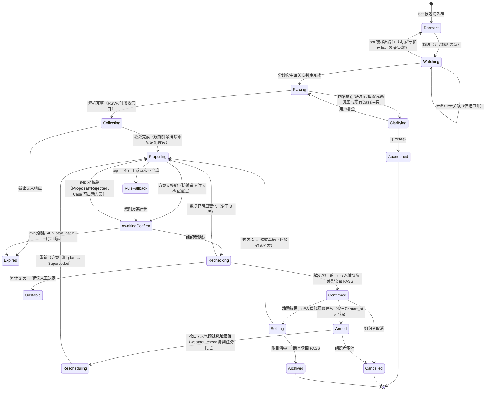

# 设计蓝图：「牵线」聚会筹办守护

> 模板来源：官方 octo-weather「行程守护」蓝图（repos/hackathon-official/docs/demo/2026-09-26/octo-weather-guardian.md）
> 蓝图版本：**v0.6 = 设计冻结候选**（v0.2 外部审计 / v0.3 范围分级 / v0.4 GPT 20 条 / v0.5 GPT 13 条 / v0.6 GPT 三轮 4 P0+7 P1 全部并入，见文末评审记录）
> 流程：v0.6 冻结 → G1/G2 实现（纵向切片）→ G3 OUP 真链路 GO/NO-GO → 用测试反过来发现蓝图漏洞

## 依赖与权限事实表（我们用什么、建什么）

| 依赖 | 性质 | 依据/状态 |
|---|---|---|
| Matrix 房间消息读写 | **我们自己的 bot 账号**（普通 Matrix 账号 + sync API），不是宿主能力、不是 store-app 沙盒能力 | 本地 Palpo 实测通过（注册→入群→收到群消息，2026-09-27）；同构机制即 Rinx `agent_chat` 的 "companion bridge-bot invites" |
| Case 活动簿（状态存储） | **自建** SQLite + Web UI | "日历"是官方 12 场景的选题方向名；活动簿是我们自建的状态存储，不是系统日历服务 |
| 天气与地点 | Open-Meteo 公开 API（forecast + geocoding，无 key） | 真实公开服务，标注采集时间 |
| LLM 理解与措辞 | **Octos Runtime（octos serve）**——guardian 作为 OUP 客户端（octoscode 同角色）按推理任务开短会话；provider（MiniMax/Kimi/本地）由 octos 配置路由 | 官方演示 AppCard→octos serve 已验证；octos registry 原生支持 minimax/moonshot/zai/local |
| 定时触发 | guardian 常驻事件循环 + **durable scheduler（SQLite 持久化）** | 不依赖宿主后台唤醒；octos goal/loop/monitor/cron 为复赛可选接入 |
| Rinx 宿主 | **零修改**：只用其现有"URL 网页卡分享" | 提交物 = 守护服务源码 + 活动簿页 + 启动说明 |

> 提交形态声明：不走 store-app/Hub 卡路径。提交边界证据归档于 `docs/competition-boundary.md`（状态见 G0 节）。

## 四条架构原则（全蓝图最高法则）

1. **SQLite Case 状态是唯一事实源；octos 会话只是一次性推理上下文。**
2. **Agent 负责理解与规划（输出严格 JSON，无工具）；Guardian 负责确定性执行与验证。**
   产品叙事："**Octos Runtime 驱动的结构化规划 Agent + 确定性业务执行器**"——不是"自主操作 App 的 Agent"，答辩时主动讲明。
3. **一次状态迁移 = 一个可追踪事务**：`case_revision + proposal_id + evidence_ref(matrix_event_id) + matrix txn_id + 审计条目` 构成完整证据链。
4. **两类动作，两种可靠性模型（v0.6 新增）**：
   - 本地状态动作：DB 事务 → assert → commit / **可回滚**；
   - 外部副作用（发消息）：**Outbox 模式**——Intent → outbox → Matrix txn 发送 → reconcile → 标记 sent；失败不是"回滚"，是 `UNKNOWN / NEED_RECONCILIATION`，用同一 txn_id 重试/查询对账。

**责任矩阵**：

| 职责 | 归属 |
|---|---|
| 事件来源 | Matrix 房间（bot 账号 sync） |
| 分诊/关联判定/规则/验证/执行/主动调度 | **Guardian 自建**（durable scheduler 持久化于 SQLite） |
| LLM 推理 | **Octos Runtime**（octos serve，OUP 短会话） |
| 业务状态 | **Guardian 自建**（SQLite，唯一事实源） |
| 呈现 | Rinx 聊天 + 活动簿网页卡（自建） |

**六项核心创新（锁死，不再加功能；天气/RSVP/AA 都是插件）**：① 群聊 = 非结构化事件源 ② Case = 长期状态事实源 ③ Octos Agent 只做结构化理解/规划 ④ Guardian 做确定性执行 ⑤ DB Readback 做最终裁判 ⑥ 新事件 → revision++ → 继续守护。

## 一句话

群聊里出现一个聚会意向，守护（bot + Case 状态机）把它认领为 Case，组织时间收敛与冲突检查，给出有来源的方案；只有组织者能确认；每个动作执行后以预期状态断言读回核验（外部副作用经 Outbox 对账）；改口、天气跨阈、AA 欠款都会让守护醒来跟进，直到账目清零、Case 归档。

## 总原则：模型写理解和提案，不写事实

| 环节 | 谁负责 |
|---|---|
| 感知 | bot 账号读被邀请房间的事件流（Matrix sync API） |
| 分诊与关联 | **规则引擎**：命中检测 + **Case 关联判定**（见下） |
| 解析 | agent（octos 短会话）：候选消息 → 结构化 JSON |
| 事实 | **确定性代码**：成员列表来自房间 API；地点对账走 geocoding；天气走 forecast；"今天/时区"由 demo_config 注入 |
| 判定 | **规则引擎**：冲突检测、天气阈值与跨阈触发、台账算术、过期判定 |
| 方案 | agent：只能引用规则引擎提供的事实与候选 |
| 执行 | 白名单动作执行器（幂等；本地/外部两种可靠性模型） |
| 核验 | **确定性断言**：动作 → 预期状态 → DB SELECT → assert → PASS/FAIL；外部副作用 → Outbox 对账 |
| 跟进 | 规则引擎：改口检测、T-24h、天气跨阈、欠款状态 |

## 对照官方评审要求

| 最佳 Agentic 评审要求 | 本设计怎么满足 |
|---|---|
| 任务完成 | 群消息 → 分诊 → 解析 → 方案 → 组织者确认 → 执行 → 断言读回/对账 → 结算归档 |
| 可靠运行 | 显式状态机；9 类失败态各有界面与恢复路径；agent 不可用降级为规则模式；入站/出站/版本三层幂等；Outbox 对账 |
| 人机协作 | 邀请即授权、organizer 身份确认、消息三级权限分类、拒绝不落 plan |

## 状态机



**语义拆分（v0.6 修订）**：Reject/Expired 首先是 **Proposal** 的状态（Pending/Approved/Rejected/Expired/Superseded）；Proposal 被拒 → Case 回到 Proposing 可出新方案，**Case 自身不进入 Rejected**。Case 级的 Expired = 截止无人响应且无活跃提案；新增 **Cancelled**（组织者取消整个活动）；"某个人不去了"只修改 members/RSVP，不是取消。

**关联判定（v0.6 修订，替代"所有命中消息优先关联 Active Case"）**：分诊命中后先做关联判定——① 明确引用现有 Case（回复上下文）② 与现有 Case 语义相关（同一活动的时间/地点/人员变更）③ @bot 指令 ④ 新活动意图。**只有 ①② 关联现有 Case**；④ 且房间已有 Active Case → **Clarifying**（"检测到新的活动意向，本房间已有进行中的活动"），绝不强行塞进现有 Case。

## 数据模型（确定性状态，LLM 永不直接写）

```
Case {
  id, room_id,
  organizer_id, organizer_source: first_message,  // 唯一确认人 = 创建消息发送者（MVP 不转移）
  created_from_msg_id,
  status: Parsing|Clarifying|Collecting|Proposing|AwaitingConfirm|Confirmed
        |Armed|Rescheduling|Settling|Archived|Expired|Abandoned|Unstable|Cancelled,
  revision: int,            // 权威快照版本：每次改变 Case 的已提交事务 +1（非仅状态枚举变化）
  weather: { status: ok|unavailable, last_checked_at?, source: open-meteo },  // 事实源字段，非生命周期状态
  rsvp: { member → slot_votes{}, deadline },
  grants:  { room_id+kind → once|standing, expiry },   // 仅 Proactive Outreach 需要；MVP 授权人 = 组织者
  audit:   [ {ts, actor, action, evidence_ref} ],       // 只追加
}

plans[ {plan_id, revision, start_at, end_at, timezone, place?, place_geocode_id?,
        activity?, source_proposal_id, status: Active|Superseded} ]   // v0.6 新增：改期 = 旧 plan Superseded + 新 plan Active

proposals[ {id, based_on_revision, request_id, content, basis_fact_ids[],
            status: Pending|Approved|Rejected|Expired|Superseded} ]

ledger[ {entry_id, payer, amount_cents, note, settled_at?} ]   // 金额只由确定性解析器写入

scheduled_tasks { id, case_id, kind: reminder|weather_check|case_deadline|activity_end,
                  due_at, status, txn_id }          // durable timer：启动重载 + 过期补偿

case_events { id, case_id, matrix_event_id, revision, type, actor, created_at, evidence_ref }

outbox { id, case_id, txn_id, kind, text, status: Pending|Sent|UNKNOWN|NEED_RECONCILIATION }

ingress_state { last_sync_token, processed_event_id[] }

// DB 约束：每房间至多一个 Active Case（部分唯一索引）；outbox 状态机由后台对账器推进
```

**revision 语义（v0.6 修订，P0）**：revision = **权威 Case 快照版本**，每次改变 Case 的已提交事务（建 Case、加成员、出新提案、批准、改期、台账变更……）+1，而非仅状态枚举变化。Proposal 记录 `based_on_revision`；**批准时校验 `proposal.based_on_revision == current.revision`**，不等 → 提案已过期（Superseded）→ 重新出方案。

## 消息三级权限分类（v0.6 修订，P0——修复"确认回执"缺口）

| 级别 | 例子 | 授权 |
|---|---|---|
| M1 Proposal（系统建议，待批准） | 时间候选方案、改期方案 | 无需 grant（否则审批死循环） |
| M2 Transaction Receipt（用户刚执行动作的系统回执） | "方案已确认""改期完成""已结算" | 无需 grant——它是用户刚授权动作的回声 |
| M3 Proactive Outreach（替用户发起的对外沟通） | 提醒大家、催付款、通知改期 | **必须** approve-once 或 standing grant |

**T-24h 语义（v0.6 修订）**：T-24h 到达 → 生成 **Reminder Proposal** 进活动簿（"提醒已准备，等待组织者允许"）；该条提醒此前被 approve-once → 自动发送；standing grant（"此类提醒自动发送"）为 P2。活动簿永远不出现"系统悄悄替用户发了消息"。

## Agent 协议与防编造校验

- **会话策略**：按推理任务开**短会话**（Case revision 级）：输入 = 候选消息 + Case 快照 + 规则事实；输出 = 一份严格 JSON；会话即弃。避免多 Case 上下文污染、旧方案污染、重试互扰。
- **注入边界（v0.6 措辞修正）**：`<room_message>` 标签**仅用于标记不可信输入边界，本身不是安全边界**。实际安全边界 = 无工具 Agent + 严格 JSON Schema（additionalProperties:false）+ 白名单 Validator + LLM 无 DB 写权限 + organizer approval + guardian 确定性执行。注入测试列入 G3。
- 校验链：JSON 结构 → 字段类型 → 时间归一化（时区取 Case.timezone）→ 地点对账（geocode 唯一命中）→ 成员对账（参与者必须在房间成员表）→ 数值对账（±1 容差）→ `basis_fact_ids` 存在性。
- **台账特殊规则**：LLM 对"我垫了 88"只产出 `candidate_ledger_text`；payer/amount_cents 由确定性解析器提取，失败 → Clarifying。LLM 永远不生成财务事实。
- 不合规：回发同一会话修一次；再犯 → `RuleFallback`。

## 白名单动作（幂等；本地=事务回滚，外部=Outbox 对账）

| 动作 | 参数约束 | 授权 | 可靠性模型 |
|---|---|---|---|
| `create_case(msg_id)` | 每房间同时至多一个 Active Case（DB 部分唯一索引） | 无需 | 本地事务 |
| `post_proposal(proposal)` | M1 级消息 | 无需 | Outbox |
| `post_receipt(receipt)` | M2 级消息（回声刚执行的动作） | 无需 | Outbox |
| `add_vote(member, slots)` | member 必须在房间成员表 | 无需 | 本地事务 |
| `set_plan(start_at, end_at, place_id)` | **只校验**：时间为未来 + 地点合法（**与预报窗口解耦**——天气可用性由 weather 字段独立表达，v0.6 修订） | 组织者确认后执行；旧 plan → Superseded | 本地事务 |
| `send_outreach(kind, text, grant_ref)` | M3 级消息；目标 = Case 房间 | ✅ approve-once / standing grant | Outbox |
| `settle_entry(entry_id, by)` | 金额来自台账 | 组织者确认后执行 | 本地事务 |
| `create_ledger_entry(candidate_text)`（P1） | payer/amount_cents 由确定性解析器提取；失败 → Clarifying | 组织者确认后执行 | 本地事务 |
| `arm_reminder(t, kind)` | t 为未来时刻；已 <24h 则跳过 | 无需 | durable scheduler |
| `cancel_case()` / `archive_case()` | cancel 限 Confirmed/Armed；archive 限 ledger 清零且 Settling | 组织者确认后执行 | 本地事务 |

## 读回断言与对账

本地动作：`{action, expected:{case.status, plan.revision, ...}}` → DB SELECT → assert → PASS 才推进，FAIL → 回退 + 审计。
外部动作：outbox `Pending → Sent`；发送异常 → `UNKNOWN/NEED_RECONCILIATION` → 同 txn_id 重试/查询 → 对账后落终态。演示话术："不要相信 agent 的自述——本地看 DB 断言，外部看 Outbox 对账。"

## 隐私架构（三条硬规则）

1. **邀请即授权**：bot 仅处理其成员身份所在房间；被移出 → Dormant，明示"守护已停，数据保留"；
2. **分诊在先、最小提取**：只有命中规则的消息进入推理，透明卡记录"本次理解使用了 msg_id=X"；未命中消息仅记审计（时间+哈希）；
3. **模型调用统一经 Octos Runtime**：本地 provider 可实现本地推理；云 provider（MiniMax/Kimi）仅发送经分诊后的最小上下文。

## 失败态清单（9 类）

| # | 失败态 | 界面表现 |
|---|---|---|
| 1 | agent 不可用 | "守护暂时离线，以下是规则建议"——RuleFallback 有限语法模板 |
| 2 | 地点无法定位/同名多个 | 澄清卡列出候选，不猜 |
| 3 | 约束做不到 | 冲突卡列出矛盾，让人裁决 |
| 4 | bot 被移出房间 | "守护已停，数据保留"，不再处理新消息 |
| 5 | 提案过期 | min(创建+48h, start_at−1h) 前未响应 → Proposal=Expired / Case=Expired |
| 6 | 重复确认 | "已确认，未重复" + 审计条目 |
| 7 | 外发失败 | Outbox → UNKNOWN/NEED_RECONCILIATION → 同 txn_id 对账，不静默重放不伪造成功 |
| 8 | 天气源不可用（P1 起） | `weather.status=unavailable`，明示"当前天气无法核验"，方案仍可维持 |
| 9 | 群消息注入尝试 | 校验器拦截越权指令 → 澄清/丢弃 + 审计（G3 测试） |

## 技术形态

```
┌─ Rinx（宿主，零修改）────────────────────────────┐
│  聚会群（双账号 + bot 账号）                      │
│  活动簿网页卡（URL 卡片分享；MVP 绑 127.0.0.1）   │
└──────────────┬───────────────────────────┘
               │ Matrix Client-Server API（bot 账号 sync）
┌──────────────┴───────────────────────────┐
│ 守护进程 guardian（OUP 客户端）           │
│  ingress 幂等 → 规则分诊 → 关联判定        │
│  规则引擎：冲突/天气阈值/台账/时间归一化    │
│  按推理任务开 octos 短会话 ── OUP ──► octos serve
│  防编造校验器 → 白名单动作执行器            │
│  本地动作=DB事务 / 外部动作=Outbox 对账     │
│  SQLite：Case/plans/proposals/ledger/     │
│          scheduled_tasks/case_events/     │
│          outbox/ingress_state（唯一事实源）│
│  活动簿 Web UI + 审计页（127.0.0.1）       │
└───────────────────────────────────────────┘
```

- **Agent 层**：LLM 由 Octos Runtime 提供（v0.3 定案）；`LlmClient` 接口保留直调 API 备胎（仅 G3 阻塞时启用，不并行开发）。
- **语言**（G0 后定）：推荐 Python；Rust 为复赛硬化选项。初赛不设 Rust 门槛（官方口径）。
- **交互 MVP**：房间关键词确认（仅 organizer 有效）+ 活动簿网页卡（127.0.0.1）；原生互动卡为复赛增强。

## 演示叙事（一条故事线 + 备用视频）

**3 分钟主线**："周六骑车"一条消息 → Case 诞生 → 方案 → 组织者确认（读回断言 PASS：DB Confirmed, plan revision=N）→ 改期风波（队友改口 → 旧 plan Superseded / 新 plan Active → 读回证明无重复创建）→ 安心赴约（T-24h 提醒提案）。中途自然撞一次失败态，展示恢复。
**备用视频**：完整脚本（AA 结算、重复确认、隐私透明卡、天气跨阈、Outbox 对账演示）。
**答辩预备**："这是 Agent 还是 JSON parser？"→ 按架构原则 2 回答；"标签能防注入吗？"→ 按注入边界措辞回答（标签只标记边界，防线在无工具+Schema+Validator+执行层）。

## 范围分级（v0.6 修订）

| 级别 | 内容 |
|---|---|
| **P0-A 主链** | Matrix bot 收消息 · 分诊+关联判定 · OUP→Octos→LLM · 严格 JSON · Validator · Case 创建 · Proposal 展示(M1) · organizer 确认 · Approve（based_on_revision 校验）· Confirmed · Readback 断言 |
| **P0-B 可信性** | revision 快照语义 · **plans 历史（Active/Superseded）** · 改期 + 旧 plan 作废 · durable scheduler（重启补偿）· 入站幂等 · 消息三级分类（M1/M2/M3）· Outbox 对账 · Agent fallback · Bot removed · Audit + case_events |
| **P0-C 提交证据** | 独立复现（run.md 双账号全流程） |
| **P1** | Weather（含 unavailable 态 + weather_check 周期任务）· T-24h（Reminder Proposal 语义）· RSVP 收集 · 简单 AA（candidate→parser→entry→settle） |
| **P2** | 催收措辞润色 · standing grant · 本地模型现场切换 · 互动卡 · 活动簿角色/token · Goal/Loop · 多 Case/多群 · organizer 显式认领/转移 · Rinx×octos 桥（悬赏 10） |

**P0 判定标准**：P0-A 连跑 + P0-B 全部演示可达 + 验收条件通过。

## 切片计划

| 片 | 内容 | 验收 | 状态 |
|---|---|---|---|
| **G0-A 工程边界审计** | 本地实测（bot 链路/Rinx 编译/依赖 vendor） | ✅ DONE（2026-09-27） | ✅ |
| **G0-B 官方规则确认** | 三个问题官方原文 → `docs/competition-boundary.md`：①提交形态（独立 guardian+bot+URL 卡）②经 OUP 使用 octos serve 作 agent 运行时 ③本地 Palpo + bot 账号作演示环境；另收集课堂包能力清单 | 🟡 WAITING OFFICIAL CONFIRMATION——拿到原文才算 COMPLETE | 🟡 |
| G1 | bot sync + 入站幂等（sync token/event_id/bot 自排除）+ SQLite schema 全量（Case/plans/scheduled_tasks/case_events/outbox/唯一索引）+ 审计 | 双账号收发落库；事件重放不重复处理；重启后 scheduled_tasks 重载 | 待办 |
| G2 | 分诊 + 关联判定 + 时间归一化 + 冲突检测 | 命中表输出，演示剧本全命中；"看电影"新意图进 Clarifying | 待办 |
| G3 | **接 octos serve（OUP 短会话）** + 严格 JSON + 防编造 + 注入测试 + **真实冒烟** | 真实 octos 会话冒烟通过；注入被拦截 | 待办 |
| G4a | Proposal/确认流（organizer 校验 + based_on_revision）+ 活动簿网页卡 + 读回断言/Outbox（干跑） | P0 全状态可达，失败态有界面 | 待办 |
| G4b | 缝合（G3×G4a） | 演示主线连跑 | 待办 |
| G5 | 改期/失败/过期/重复 + scheduler 补偿测试 + P1 项 + 验收逐条自测 | 全剧本 + 验收条件表 | 待办 |

**硬规则**：G3 = GO/NO-GO 门。真实冒烟失败 → 禁止堆 G4 界面，全力打通 OUP 或启用直调备胎。

## 排期（G0-B 答案落地前不锁代码结构；G0-A 无关部分先行）

| 日期 | 目标 |
|---|---|
| 9/28 | G0-B 求证 + G1（schema 全量 + 入站幂等） |
| 9/29 | G2（规则引擎 + 关联判定） |
| 9/30 | G3（OUP + 防编造 + 注入 + 真实冒烟）——GO/NO-GO |
| 10/1 | G4a（界面干跑 + 断言） |
| 10/2 | G4b 缝合 + G5 开始 |
| 10/3 | G5 完成 + 官方答疑门诊 + 队外用户试用 |
| 10/4 | 提交检查门诊 → 23:59 前提交（冻结版本 = 当日构建） |

## 对抗评审记录

### 第 0 轮（Claude，地基核查）
4 条质疑：3 条因信息源过时被实测驳回（Rinx 在 hagency-org、本地编译通过、bot 链路实测通过），1 条采纳（能力边界表述 → 依赖事实表）。降级预案 Plan B/C 记录备查。

### 第 1 轮（GPT，v0.3 全文 20 条 → v0.4）
P0 采纳：Agent 定位叙事 · 按推理任务短会话（单 active turn 语义经本地 vendored octos UCR 文档验证）· Proposal/对外动作权限二分 · organizer_id 确认权限 · 改期入 P0。工程采纳：start_at/end_at/timezone · 固定时区 · 单 Active Case · case_revision+UUID · 读回断言格式 · WeatherUnavailable · 跨阈触发定义 · 过期与活动时间联动 · 隐私文案 · 注入防线入 G3 · 台账 candidate_text · Matrix txn 幂等 · SQLite 唯一事实源 · P0 17 项。

### 第 2 轮（GPT，v0.4 工程审阅 13 条 → v0.5）
P0 采纳：organizer_id 产生规则（=创建消息发送者，不转移）· durable scheduler（scheduled_tasks + 启动重载 + 过期补偿）· 入站幂等（sync token + event_id + bot 自排除）。P1 采纳：天气降为事实源字段 · 被拒 Proposal 保留历史 · Approve 绑定 proposal_id+revision · bot 自身消息不入分诊 · 活动簿访问控制（MVP 绑 127.0.0.1）· organizer/grant 主体分离 · RuleFallback 有限语法 · create_ledger_entry 路径 · case_events 时间线 · G0 状态纪律 · G3 GO/NO-GO · P0 分组 A/B/C · 六项创新锁死 · 责任矩阵 · 原则 3。

### 第 3 轮（GPT，v0.5 审阅 4 P0 + 7 P1 → **v0.6，全部采纳，设计冻结候选**）
P0 采纳：① revision 语义改为"权威快照版本"（每次已提交事务 +1；proposal.based_on_revision 批准校验）② **plans 历史表**（Active/Superseded——修复"旧 plan 作废"无落库表示 + 读回示例引用不存在的 plan.revision）③ 消息三级分类（新增 M2 Transaction Receipt——修复确认回执无授权定义缺口）④ 外部副作用 Outbox + 对账（本地=事务回滚、外部=UNKNOWN/NEED_RECONCILIATION，修复"readback FAIL 回退"对外部动作不成立）。
P1 采纳：⑤ T-24h → Reminder Proposal 语义（无 grant 不静默发送）⑥ weather_check 进 durable scheduler（kind 枚举）⑦ set_plan 与预报窗口解耦 ⑧ Proposal/Case 的 Rejected/Expired 语义拆分 + 新增 Case Cancelled ⑨ Case 关联判定四分法（替代"优先关联 Active Case"）⑩ 注入边界措辞修正（标签非安全边界）⑪ G0 拆分 G0-A DONE / G0-B WAITING，三个求证问题统一。
流程结论（三方一致）：设计冻结，进入 G1/G2 纵向切片实现 + G3 GO/NO-GO；用测试反过来发现蓝图漏洞。